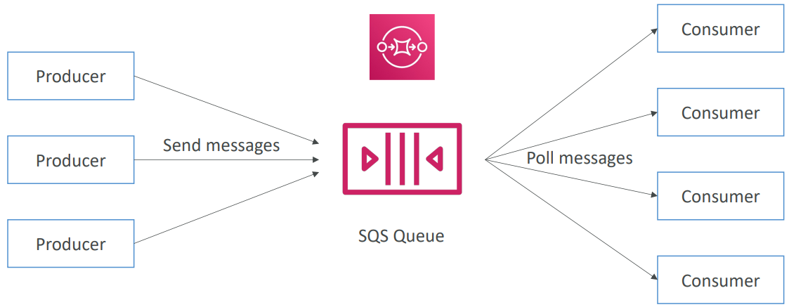

# SQS
Messaging: When we deploy multiple apps, they will need to communicate with each other.
There are two patteerns of the app communication:
    a. Synchronous Communication (app to app) \
    b. Asynchronous/ Event Based (app to queue to app)

    Understanding with a few lines:
    a. Synchronous between apps can be problematic if there are sudden spikes of traffic
    b what is you need to suddenly encode 1000 videos but usually it's 10?
    b. In that case, it's better to decouple your apps:
        i. using SQS: queue model
        ii. using SNS: pub/sub model
        iii. unsing Kinesis: real-time streaming model

Amazon SQS. What is a queue?

Amazon SQS - Standard Queue
a. Fully managed service, used to decouple apps
b. Attributes:
    i. Unlimited throughput, unlimited no. of msgs in queue
    ii. Default retention of msgs: 4 days, maximum of 14 days
    iii. Low Latency (<10 ms on publish and receive)
    iv. Limitation of 256KB per msg sent
c. Can have duplicate msgs (at least once delivery, occasionally)
d. Can have out of order msgs

Ref. slide in this same directory. Time is short. Page number 382

